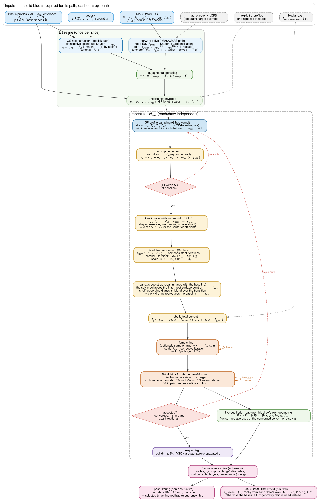

# bouquet

[](https://doi.org/10.5281/zenodo.19398541)
[](https://github.com/d-burg/bouquet/actions/workflows/tests.yml)


**BO**otstrap **U**ncertainty **QU**antified **E**quilibrium **T**oolkit

GP-sampled perturbed tokamak equilibria for uncertainty quantification with
OpenFUSIONToolkit/TokaMaker.

bouquet generates families ("bouquets") of perturbed equilibria from a baseline
kinetic equilibrium: correlated Gaussian-process perturbations of n_e, T_e,
T_i, Z_eff-consistent densities and j_phi drawn within measured uncertainties,
per-draw Sauter bootstrap recomputation, l_i band conditioning against
magnetics, a Grad–Shafranov solve per sample, and coil/boundary in-spec
filtering — all archived to one self-describing, provenance-stamped HDF5
database.

- **Two baseline sources, one API.** A **reconstruction** (g-file plus kinetic
  profiles from an Osborne p-file or an IDA netCDF), which bouquet reconstructs
  and separates into inductive and bootstrap current itself; or an
  **IMAS/OMAS** data-dictionary JSON (e.g. FUSE output) that already carries
  the separated currents, kinetic profiles, and fast-ion pressure.
- **Perturb, condition, solve.** Kinetic profiles are sampled from a GP
  posterior with spatially varying correlation lengths; densities follow from
  quasi-neutrality with the drawn Z_eff; the bootstrap is recomputed per draw
  and the inductive current is scaled to hold l_i in band.
- **Coil-realizable by construction.** Each GS solve runs under a progressive
  coil-bound homotopy, and every draw is tagged `in_spec` against
  engineering-motivated coil-drift and boundary-RMS thresholds.
- **Archive and export.** Byte-perfect g-file/p-file payloads, per-draw
  diagnostics, filter flags, and the exact config that produced the run — plus
  export to per-draw file bundles or IMAS/OMAS IDS with exact per-draw
  flux-surface geometry.
- **Scales out.** Process-parallel generation with bit-reproducible
  single-threaded shards, on a laptop pool or a SLURM job array.

[](https://d-burg.github.io/bouquet/flowchart/)

The same page hosts the **full logic map** — every config knob, decision gate,
and artifact (550+ nodes), each with a `file:line` anchor:
**[explore interactively](https://d-burg.github.io/bouquet/flowchart/)**.

---

## Installation

```bash
git clone https://github.com/d-burg/bouquet.git
cd bouquet
pip install -e ".[dev]"
```

**Requires [OpenFUSIONToolkit](https://github.com/hansec/OpenFUSIONToolkit)
v26.6 or newer** for equilibrium generation (v26.6 introduced the dict-form
flux-surface-average returns that the exact-fidelity per-draw geometry capture
depends on; legacy positional layouts are still supported). OFT is installed
separately, following its own instructions. Everything else — the GEQDSK/p-file/
IDA/IMAS readers, COCOS conversion, archive reading, and all plotting — works
without it. Python dependencies (`numpy`, `scipy`, `matplotlib`, `h5py`) are
handled by pip.

Three helpers keep setups portable: `bq.add_oft_to_path()` resolves the OFT
install (`OFT_PYTHONPATH` env var → known locations → walk-up),
`bq.find_mesh()` locates the TokaMaker mesh (`BOUQUET_MESH` → walk-up →
bundled example mesh), and `bq.find_ida()` locates an IDA `.cdf` (`BOUQUET_IDA`,
a file or a directory searched recursively → walk-up) — kinetic data is
typically too large to keep in an analysis repo, so a notebook names the file
without naming the machine. All raise with the full list of locations tried.

## Quickstart

### Reconstruction source — g-file + kinetic profiles

```python
import bouquet as bq

b = bq.Bouquet.from_geqdsk(
    "baseline.geqdsk",
    profiles="baseline.peqdsk",      # p-file or IDA .cdf (auto-detected)
    mesh=bq.find_mesh(),
    n_draws=20, header="my_run",
)

b.reconstruct()                      # GS reconstruction + fidelity summary
# b.verify_sigma0_consistency()      # recommended on a new machine/OFT build:
                                     # one ~1 min solve confirming the draw
                                     # pipeline reproduces the baseline at σ=0
b.generate()                         # perturbed draws -> my_run.h5
b.filter()                           # mark the machine-realizable subset
b.export()                           # -> my_run_selected.h5
```

### IMAS/OMAS source — a data-dictionary JSON

```python
b = bq.Bouquet.from_imas(
    "dd_sim.json", mesh=bq.find_mesh(),
    time=2.1, n_draws=20, header="my_imas_run",
)

b.prepare()                          # source-agnostic baseline stage
b.generate(); b.filter(); b.export()

# ...or the whole pipeline in one call:
b.run()                              # setup -> baseline -> generate -> filter -> export
```

Then visualise or read the result:

```python
b.plot_bouquet()                     # or bq.plot_bouquet("my_run.h5", scan_key=0)
b.plot_traces()

ar = bq.BouquetArchive("my_run.h5")
for d in ar["0"].selected:
    print(d.count, d.li1, d.flags)

cfg = bq.load_config("my_run")       # the exact BouquetConfig that made it
```

## The workflow surface

| Stage | Call | What it does |
|---|---|---|
| Solver | `setup_solver()` | Stand up TokaMaker from `SolverConfig`. Idempotent |
| Baseline | `prepare()` — or `reconstruct()` on the g-file path | Resolve the baseline; `reconstruct()` also prints the reconstruction-fidelity summary |
| Guard (optional) | `verify_sigma0_consistency()` | One bootstrap solve confirming the *draw* pipeline reproduces the *baseline* j_BS split at σ=0 — recommended on a new machine or OFT build, before spending draw compute |
| Draws | `generate()` | Sample, condition, solve, archive to `{header}.h5` |
| Selection | `filter()` | Coil-drift + boundary-RMS filters, written as non-destructive flags |
| Export | `export()` / `export_bundle()` / `export_ids()` | Pruned HDF5, per-draw g-file/p-file/profiles-JSON bundle, or one IMAS/OMAS IDS per draw |
| All of it | `run()` | The five stages above, in order |

`b.describe()` prints the current configuration showing only the non-default
knobs. Sweeps: `b.run_slices(times=[...])` puts one time slice per `scan_key`
in a single archive; `bq.parallel_generate(cfg, backend="laptop"|"slurm")`
fans draws out across processes.

## Key configuration

Knobs live on config sub-objects reachable from the run object; set them before
`generate()`.

```python
b.uncertainty.ne_scalar_sigma = 0.05   # flat 5% envelope when no measured sigmas
b.uncertainty.jphi_scalar_sigma = 0.10
b.generation.n_equils = 50
b.generation.l_i_tolerance = 0.05      # FRACTION of target (0.05 = 5%)
b.generation.seed = 1234
```

| Knob | Default | Meaning |
|---|---|---|
| `uncertainty.ne_scalar_sigma` / `te_` / `ni_` / `ti_` | `0.05` / `0.05` / `0.10` / `0.10` | Flat fractional envelopes, used when no IDA sigmas are supplied |
| `uncertainty.jphi_scalar_sigma` | `0.10` | Inductive-current envelope; must be > 0 |
| `uncertainty.zeff_scalar_sigma` | `0.05` | One Z_eff per draw; n_i / n_z follow from quasi-neutrality |
| `uncertainty.ida_path` | `None` | IDA `.cdf` supplying measured sigma envelopes instead of the scalars. **Wins over the scalars above** — see the precedence note below |
| `uncertainty.log_sigma_sources` | `True` | Log which source each kinetic sigma actually resolved from |
| `generation.n_equils` | `20` | Draws to attempt |
| `generation.n_inspec_target` | `None` | Set it to draw **until N draws pass the filters** instead of exactly `n_equils` — `n_equils` becomes the initial allocation. The stopping rule uses the same predicate `filter()` applies, so the count it stops on is the count marked `selected`. Serial only |
| `generation.max_total_draws` | `None` | Attempt cap for the above (default `5 × n_inspec_target`). Reaching it warns and returns what was achieved |
| `generation.seed` | `None` | The run's one seed. Set it and the ensemble is **bitwise** reproducible |
| `generation.l_i_tolerance` | `0.05` | l_i acceptance band, as a fraction of target |
| `generation.scan_key` | `0` | Label for this bouquet within the archive |
| `generation.jbs_delta_mode` | `False` | Opt-in differential bootstrap: per-draw spike as baseline + raw solver delta against a cached σ=0 reference |
| `generation.kinetic_source` | `"fuse"` | IMAS path; `"ida_hybrid"` takes ne/Te/Ti/ω_tor from IDA fits while keeping FUSE currents and equilibrium |
| `generation.homotopy_passes` | `[(0.05,0.10), (0.02,0.05), (0.01,0.01)]` | Progressive `(F_tol, VSC_tol)` coil-bound schedule |
| `generation.capture_live_eq` | `True` | Per-draw flux-surface-average capture — what enables `fidelity="exact"` IDS export |
| `filtering.inspec_F_max` / `inspec_VSC_max` | `0.02` | Coil-drift spec for the `in_spec` flag |
| `filtering.rms_max_mm` | `5.0` | Boundary-RMS acceptance threshold |
| `solver.nthreads` | `1` | Recommended to keep at 1; parallelise across time slices or discharges instead (`run_slices` / `parallel_generate`) |

Every tolerance is a **fraction**, never a percentage. The full table, and the
IMAS/geqdsk workflow presets that `from_imas` / `from_geqdsk` auto-apply, are
in [`docs/workflows.md`](docs/workflows.md#configuration-reference). Full
control goes through `bq.BouquetConfig`, which serializes to JSON
(`to_dict` / `from_dict`) and is stamped into every archive.

**Reproducibility.** `generation.seed` is consumed exactly once, into one
`numpy.random.Generator` that is threaded into every draw — the GPR kinetic,
Z_eff/aux and j_φ channels, the per-draw bootstrap scale and the per-draw l_i
target. Same seed + same inputs + same solver (at `nthreads=1`) gives a
**bitwise-identical** archive *on one machine*; across machines the draws agree
to ~1e-9 rather than bitwise -- the GP kernel is factorised by a fixed-order
Cholesky, which leaves a LAPACK build no discrete choices, so only rounding
differs between builds. `seed=None` draws from OS entropy.

**Kinetic-sigma precedence.** Per channel, `uncertainty.sigma_profiles[chan]`
beats an IDA `.cdf` beats `<chan>_scalar_sigma` — and a `.cdf` passed as
`ReconstructionSource.profiles_path` counts as an IDA source. A winning source
*shadows* the others, so zeroing the scalars against an IDA file does nothing:
to force a specific envelope (e.g. zero, for a deterministic point) pass
`sigma_profiles`. The resolved source is logged per channel, and a
deliberately-set-but-ignored scalar raises a warning.

## Examples

Runnable notebooks on fully synthetic, non-proprietary D3D-like fixtures live
in [`examples/`](examples/README.md) — a g-file/p-file walkthrough, an
IMAS/OMAS walkthrough with a timeseries sweep, a process-parallel example, and
a backend-systematics study.

## Documentation

| | |
|---|---|
| [`docs/`](docs/README.md) | Documentation index |
| [`docs/workflows.md`](docs/workflows.md) | Pipeline stages, full config reference, archives, export, sweeps, parallel generation |
| [`docs/physics-notes.md`](docs/physics-notes.md) | σ=0 guard, bootstrap treatment, kinetics regridding, what the ensemble is and isn't |
| [`docs/coil-constraints.md`](docs/coil-constraints.md) | Coil classes, VSC drift metric, homotopy, `in_spec` |
| [`docs/io-and-plotting.md`](docs/io-and-plotting.md) | Readers/writers, COCOS, plotting catalogue |
| [`docs/api-reference.md`](docs/api-reference.md) | Every public name |
| [`docs/archive-schema.md`](docs/archive-schema.md) | HDF5 archive layout (schema v2) |
| [`architecture.md`](architecture.md) | Physics assumptions, conventions, numerical approximations, limitations |

## Testing

```bash
pytest tests/           # fast suite (no TokaMaker required)
pytest -m solver        # live GS solver integration tests
```

The fast suite is the default (`addopts = -m "not solver"`); CI runs it on a
pinned and a latest dependency matrix so upstream numpy/scipy changes surface
as their own signal. See [`docs/CI.md`](docs/CI.md).

## Citation

If you use bouquet in your research, please cite it (see also
[`CITATION.cff`](CITATION.cff) / the "Cite this repository" button):

> Burgess, D., Hansen, C. (2026). bouquet: BOotstrap Uncertainty QUantified
> Equilibrium Toolkit (v1.0.0). Zenodo. https://doi.org/10.5281/zenodo.19398541

## License

LGPL-3.0 — see [LICENSE](LICENSE).
