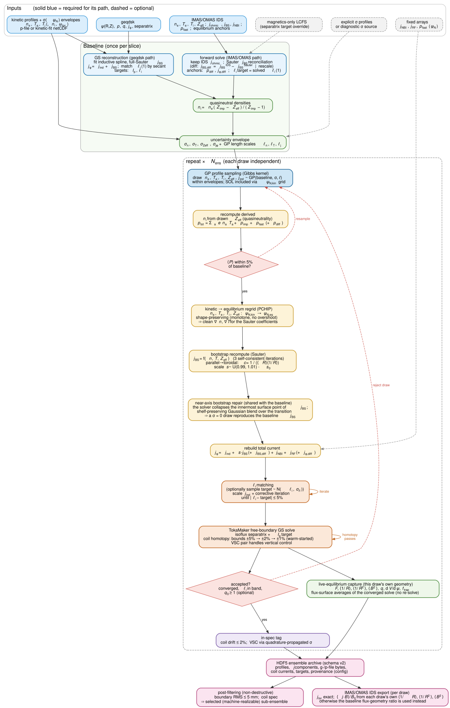

# bouquet

[](https://doi.org/10.5281/zenodo.19398541)
[](https://github.com/d-burg/bouquet/actions/workflows/tests.yml)


**BO**otstrap **U**ncertainty **QU**antified **E**quilibrium **T**oolkit

GP-sampled perturbed tokamak equilibria for uncertainty quantification with
OpenFUSIONToolkit/TokaMaker.

bouquet generates families ("bouquets") of perturbed equilibria from a baseline
kinetic equilibrium: correlated Gaussian-process perturbations of n_e, T_e,
T_i, Z_eff-consistent densities and j_phi drawn within measured uncertainties,
a per-draw bootstrap iterated to self-consistency with each solved
equilibrium (Redl), l_i band conditioning against
magnetics, a Grad–Shafranov solve per sample, and coil/boundary in-spec
filtering — all archived to one self-describing, provenance-stamped HDF5
database.

- **Two baseline sources, one API.** A **reconstruction** (g-file plus kinetic
  profiles from an Osborne p-file or an IDA netCDF), which bouquet reconstructs
  and separates into inductive and bootstrap current itself; or an
  **IMAS/OMAS** data-dictionary JSON (e.g. FUSE output) that already carries
  the separated currents, kinetic profiles, and fast-ion pressure.
- **Perturb, condition, solve.** Kinetic profiles are sampled from a GP
  posterior with spatially varying correlation lengths; densities follow from
  quasi-neutrality with the drawn Z_eff; the bootstrap is re-evaluated on each
  draw's own equilibrium until it is self-consistent (`jbs_self_consistent`,
  on by default; `False` keeps the legacy frozen bootstrap) and the inductive
  current is scaled to hold l_i in band.
- **Coil-realizable by construction.** Each GS solve runs under a progressive
  coil-bound homotopy, and every draw is tagged `in_spec` against
  engineering-motivated coil-drift and boundary-RMS thresholds.
- **Archive and export.** Byte-perfect g-file/p-file payloads, per-draw
  diagnostics, filter flags, and the exact config that produced the run — plus
  export to per-draw file bundles or IMAS/OMAS IDS with exact per-draw
  flux-surface geometry.
- **Scales out.** Process-parallel generation with bit-reproducible
  single-threaded shards, on a laptop pool or a SLURM job array.

[](https://d-burg.github.io/bouquet/flowchart/)

The same page hosts the **full logic map** — every config knob, decision gate,
and artifact (550+ nodes), each with a `file:line` anchor:
**[explore interactively](https://d-burg.github.io/bouquet/flowchart/)**.

---

## Installation

```bash
git clone https://github.com/d-burg/bouquet.git
cd bouquet
pip install -e ".[dev]"
```

**Requires [OpenFUSIONToolkit](https://github.com/hansec/OpenFUSIONToolkit)
v26.6 or newer** for equilibrium generation (v26.6 introduced the dict-form
flux-surface-average returns that the exact-fidelity per-draw geometry capture
depends on; legacy positional layouts are still supported). OFT is installed
separately, following its own instructions; `tools/install_oft.py` builds a
given OFT branch or commit, reusing already built external libraries (`--libs`).
Everything else — the GEQDSK/p-file/
IDA/IMAS readers, COCOS conversion, archive reading, and all plotting — works
without it. Python dependencies (`numpy`, `scipy`, `matplotlib`, `h5py`) are
handled by pip.

Three helpers keep setups portable: `bq.add_oft_to_path()` resolves the OFT
install (`OFT_PYTHONPATH` env var → known locations → walk-up),
`bq.find_mesh()` locates the TokaMaker mesh (`BOUQUET_MESH` → walk-up →
bundled example mesh), and `bq.find_ida()` locates an IDA `.cdf` (`BOUQUET_IDA`,
a file or a directory searched recursively → walk-up) — kinetic data is
typically too large to keep in an analysis repo, so a notebook names the file
without naming the machine. All raise with the full list of locations tried.

### Solver build requirement

The self-consistent bootstrap loop and the unified reconstruction engine
(`generation.reconstruction_engine="unified"`, the default) were validated on an
OpenFUSIONToolkit build carrying two fixes on top of upstream, developed on the
branch `fix/jphi-update-ravgs-and-nonfinite-abort` of the OpenFUSIONToolkit fork
at `github.com/d-burg/OpenFUSIONToolkit`; they are not yet part of an upstream
release:

- **jphi-update flux-surface average:** the `<1/R>` average used when a
  `j_phi` profile is handed to the solver was read one radial node off; the
  fix uses each surface's own value.
- **Non-finite abort:** a Grad-Shafranov solve that produces a NaN/Inf now
  stops at once with an error, instead of iterating to the iteration cap.

On an upstream build bouquet runs, but does not detect the difference (it only
records the OFT version, git hash and the SHA-256 of the loaded OFT library in
every archive). Measured on the
repository's synthetic examples with the live-solver tests (`pytest -m solver`)
on both builds: every l_i and q value the tests record agreed within 0.12 %
(l_i(3) of the engine on the g-file example: +0.001 %; q0 and q95: ±0.09 %),
and the pass/fail verdicts were the same apart from one test that compares with
numbers measured on one specific build. (Measured before the canonical coil-solve
mode below; that mode moves the same quantities by at most 5e-4 relative.) A solve that goes non-finite runs to the
iteration cap on an upstream build (one zero-perturbation check took 5.7×
longer). Run `verify_sigma0_consistency()` on a new machine or OFT build.
Which commits and which build the quoted validation numbers were measured on
is in [docs/validation-provenance.md](docs/validation-provenance.md).

**Results change by default with this release:**

- the **unified reconstruction engine is the default**
  (`generation.reconstruction_engine="unified"`, was `"legacy"`): one
  reconstruction loop for g-file and IDS inputs, which also runs the draws
  ([docs/engine.md](docs/engine.md)). `reconstruction_engine="legacy"`
  restores the legacy reconstruction and draws (see "Legacy or unified?"
  below); a configuration stored before the engine existed replays as
  `"legacy"`. Legacy-only settings are refused under the engine, with that
  instruction;
- one `<j.B>` -> `<j_phi>` conversion in the package, `F<1/R>/<B^2>` (the
  engine's): the legacy bootstrap at the pedestal drops by ~6.4-6.8 % on the
  synthetic example (it used `<j.B>/(F<1/R>)`); not switchable;

The following hold on both engines:

- the bootstrap is iterated to self-consistency
  (`generation.jbs_self_consistent=True`); `False` restores the frozen
  bootstrap (legacy engine only: the unified engine IS the loop);
- a non-zero separatrix pressure p_sep is kept: the solver is handed the
  axis target p_axis - p_sep (its own pressure is zero at the boundary), and
  p_sep is added back wherever pressure, beta or W_MHD is reported or written
  (`generation.separatrix_pressure="offset"`); `"legacy"` restores the
  previous behaviour (the full axis pressure as the target);
- one coil solve for the whole run: the solver's bounded coil mode is entered
  once, at `setup_solver`, so the reconstruction, the sigma=0 check and every
  draw use the same coil least-squares solve whatever order they run in.
  Measured on the synthetic examples, this moves reconstructions by at most
  5e-7 relative (l_i, q0) and archived draws by at most 5e-4 relative. Yields
  and in-spec flags are unchanged. It is not switchable: it removes a
  call-order dependence;
- the draws' loop may take up to 12 passes (`jbs_max_passes_draw`, was 6),
  and up to 6 after the homotopy (`jbs_max_passes_post_homotopy`);
- a draw whose homotopy rollback re-solve fails is now REJECTED
  (`homotopy_rollback_failed`) instead of continuing from a stale state.
  This applies on both paths, so legacy yields can change;
- the IMAS reader reads each beam (NBI) and sawteeth entry at the slice
  TIME, never interpolated. The `core_sources` slice is the one nearest the
  `core_profiles` slice read and must lie within half the local
  `core_profiles` time-step of it, else the read is REFUSED naming both
  times. Each entry is matched to its nearest own slice, accepted within
  half its own local step AND within half the local `core_profiles` step;
  when neither time base has a local step (single-time bases) the window is
  10 us (`IMAS_SINGLE_TIME_WINDOW_S`, owner-approved 2026-10-07), so a
  rounding-level mismatch of millisecond-stored times is a match with its
  dt recorded. A beam entry with no such slice is REFUSED, never read at another time or
  dropped to zero -- unless it carries no current on its own slices
  bracketing that time (off there, zero), or the slice comes BEFORE its
  first own time (off before its record: zero, stamped `off_before_record`,
  announced once). Every match is recorded with its dt
  (`Baseline.source_time_match`; the engine's
  `provenance["source_time_match"]`);
- a negative pressure at the separatrix is refused under `"offset"`, for the
  baseline (`prepare_baseline`) as well as the draws. Setting
  `separatrix_pressure="legacy"` builds such an input as before.

A configuration stored by an earlier version (an archive's config) loads with
a warning naming every field it changes:

- a field the configuration predates gets the value it was produced with,
  where that is knowable (a loop configuration without
  `jbs_relax_current` / `jbs_relax_halve_on` loads with 1.0 / 1, what it
  ran); otherwise today's default, with a LOUD warning -- on every stored
  configuration, legacy or unified;
- a legacy-path field that the unified engine never read loads at its
  default, because the default is what that run used;
- `load_config` reads back the coil-solve mode the stored run was in and
  warns when it predates the canonical (bounded) mode.

See `docs/CHANGES_SUMMARY.md` for every change and how to restore each.

### Legacy or unified?

Use the **unified engine** (the default) for new work: one reconstruction
loop and one draw route for g-file and IDS inputs, every convergence row
checked on the delivered equilibrium, and several times faster than the
legacy path with the bootstrap loop on (reconstructions 38–76 s vs
150–660 s, draws 60–144 s vs 405–1407 s on the shipped synthetic cases).
Choose `reconstruction_engine="legacy"` only to reproduce or compare with an
earlier run, or for a legacy-only feature (the closure channels and
structured-preset settings, `jbs_self_consistent=False`, SWB mechanics, the
`diff+C` IMAS workflow). A pre-release run is reproduced by setting
`reconstruction_engine="legacy"`, `jbs_self_consistent=False` and
`separatrix_pressure="legacy"` together, up to the canonical coil-solve mode
(<= 5e-4 relative on draws) and the one current conversion (the frozen
bootstrap is ~6.4-6.8 % lower at the pedestal), neither of which is
switchable; a stored configuration that predates these fields gets them on
load. Legacy-only settings on a unified configuration are refused, not
ignored, and the error says to set `reconstruction_engine="legacy"`.
The engine can be named at construction (`from_geqdsk` / `from_imas(...,
reconstruction_engine="legacy")`) or set afterwards
(`bq.generation.reconstruction_engine = "legacy"`): the order no longer
matters, because the settings whose validated value depends on the engine
(`isolate_edge_jBS`, `perturb_jind_in_anchor`) are left unset by the
factories and resolved when `prepare_baseline()` runs, and the archive
records how ([engine.md](docs/engine.md)).

## Quickstart

### Reconstruction source — g-file + kinetic profiles

```python
import bouquet as bq

b = bq.Bouquet.from_geqdsk(
    "baseline.geqdsk",
    profiles="baseline.peqdsk",      # p-file or IDA .cdf (auto-detected)
    mesh=bq.find_mesh(),
    n_draws=20, header="my_run",
    # reconstruction_engine="legacy",  # the legacy paths (default: "unified")
)

b.reconstruct()                      # GS reconstruction + fidelity summary
# b.verify_sigma0_consistency()      # recommended on a new machine/OFT build:
                                     # one ~1 min solve confirming the draw
                                     # pipeline reproduces the baseline at σ=0
b.generate()                         # perturbed draws -> my_run.h5
b.filter()                           # mark the machine-realizable subset
b.export()                           # -> my_run_selected.h5
```

### IMAS/OMAS source — a data-dictionary JSON

```python
b = bq.Bouquet.from_imas(
    "dd_sim.json", mesh=bq.find_mesh(),
    time=2.1, n_draws=20, header="my_imas_run",
)

b.prepare()                          # source-agnostic baseline stage
b.generate(); b.filter(); b.export()

# ...or the whole pipeline in one call:
b.run()                              # setup -> baseline -> generate -> filter -> export
```

Then visualise or read the result:

```python
b.plot_bouquet()                     # or bq.plot_bouquet("my_run.h5", scan_key=0)
b.plot_traces()

ar = bq.BouquetArchive("my_run.h5")
for d in ar["0"].selected:
    print(d.count, d.li1, d.flags)

cfg = bq.load_config("my_run")       # the exact BouquetConfig that made it
```

## The workflow surface

| Stage | Call | What it does |
|---|---|---|
| Solver | `setup_solver()` | Stand up TokaMaker from `SolverConfig`. Idempotent |
| Baseline | `prepare()` — or `reconstruct()` on the g-file path | Resolve the baseline; `reconstruct()` also prints the reconstruction-fidelity summary |
| Guard (optional) | `verify_sigma0_consistency()` | Confirms the *draw* pipeline reproduces the *baseline* j_BS split at σ=0 (with the default self-consistent bootstrap: an unperturbed draw, on every route the configuration can use, reproduces the one reconstruction state -- bootstrap, current, l_i -- at the loop's tolerances) — recommended on a new machine or OFT build, before spending draw compute |
| Draws | `generate()` | Sample, condition, solve, archive to `{header}.h5` |
| Selection | `filter()` | Coil-drift + boundary-RMS filters, written as non-destructive flags |
| Export | `export()` / `export_bundle()` / `export_ids()` | Pruned HDF5, per-draw g-file/p-file/profiles-JSON bundle, or one IMAS/OMAS IDS per draw |
| All of it | `run()` | The five stages above, in order |

`b.describe()` prints the current configuration showing only the non-default
knobs. Sweeps: `b.run_slices(times=[...])` puts one time slice per `scan_key`
in a single archive; `bq.parallel_generate(cfg, backend="laptop"|"slurm")`
fans draws out across processes.

## Key configuration

Knobs live on config sub-objects reachable from the run object; set them before
`generate()`.

```python
b.uncertainty.ne_scalar_sigma = 0.05   # flat 5% envelope when no measured sigmas
b.uncertainty.jphi_scalar_sigma = 0.10
b.generation.n_equils = 50
b.generation.l_i_tolerance = 0.05      # FRACTION of target (0.05 = 5%)
b.generation.seed = 1234
```

| Knob | Default | Meaning |
|---|---|---|
| `uncertainty.ne_scalar_sigma` / `te_` / `ni_` / `ti_` | `0.05` / `0.05` / `0.10` / `0.10` | Flat fractional envelopes, used when no IDA sigmas are supplied |
| `uncertainty.jphi_scalar_sigma` | `0.10` | Inductive-current envelope; must be > 0 |
| `uncertainty.zeff_scalar_sigma` | `0.05` | One Z_eff per draw; n_i / n_z follow from quasi-neutrality |
| `uncertainty.zeff_sigma_source` | `"auto"` | Tier supplying the Z_eff envelope's magnitude — the IDA-resolved envelope (VB+CER > CER > VB, the resolution the baseline Z_eff came from) > scalar. `"measured"` / `"scalar"` force one, `"carbon"` overrides with the carbon route alone; every step down warns. See [workflows.md](docs/workflows.md#uncertaintyconfig-buncertainty) |
| `uncertainty.ida_path` | `None` | IDA `.cdf` supplying measured sigma envelopes instead of the scalars. **Wins over the scalars above** — see the precedence note below |
| `uncertainty.log_sigma_sources` | `True` | Log which source each kinetic sigma actually resolved from |
| `generation.n_equils` | `20` | Draws to attempt |
| `generation.n_inspec_target` | `None` | Set it to draw **until N draws pass the filters** instead of exactly `n_equils` — `n_equils` becomes the initial allocation. The stopping rule uses the same predicate `filter()` applies — including the configured coil filter (`filtering.coil_filter`, chi2 by default) with the same per-coil sigma, DAQ era and acceptance thresholds — so the count it stops on is the count marked `selected`. On the parallel launchers the workers pool their count through a shared ledger and stop cooperatively once the run's one target is met |
| `generation.max_total_draws` | `None` | Attempt cap for the above (default `5 × n_inspec_target`, never below `n_equils`; an explicit value is a hard ceiling even below `n_equils`). Reaching it warns and returns what was achieved |
| `generation.seed` | `None` | The run's one seed. Set it and the ensemble is **bitwise** reproducible |
| `generation.l_i_tolerance` | `0.05` | l_i acceptance band, as a fraction of target |
| `generation.scan_key` | `0` | Label for this bouquet within the archive |
| `generation.jbs_delta_mode` | `False` | Opt-in differential bootstrap: per-draw spike as baseline + raw solver delta against a cached σ=0 reference |
| `generation.kinetic_source` | `"fuse"` | IMAS path; `"ida_hybrid"` takes ne/Te/Ti/ω_tor from IDA fits while keeping FUSE currents and equilibrium |
| `generation.homotopy_passes` | `[(0.05,0.10), (0.02,0.05), (0.01,0.01)]` | Progressive `(F_tol, VSC_tol)` coil-bound schedule |
| `generation.capture_live_eq` | `True` | Per-draw flux-surface-average capture — what enables `fidelity="exact"` IDS export |
| `filtering.coil_filter` | `"chi2"` | Coil rule used by `Bouquet.filter()`. `"chi2"` = measurement-referenced χ²/ν + worst-\|z\| guard; `"legacy"` = the ±`inspec_*` band. **The default changed** — see [`docs/CHANGES_SUMMARY.md`](docs/CHANGES_SUMMARY.md) |
| `filtering.chi2_max` / `z_max` | `None` | `None` → the device's calibrated acceptance (DIII-D: 6.1 / 6.3), else the generic 4 / 5. `z_max=False` disables the guard |
| `filtering.coil_sigma` | `None` | Per-coil σ override; `None` → the device tolerance model (needs no dd) |
| `filtering.coil_daq_era` | `None` | Acquisition era setting the σ **floor**; never guessed from a name or path |
| `device` | `None` | Device name for the tolerance model (`bouquet.devices`); detected from the mesh coil names when they match exactly |
| `filtering.inspec_F_max` / `inspec_VSC_max` | `0.02` | Coil-drift spec for the `in_spec` flag, and the band `coil_filter="legacy"` applies |
| `filtering.rms_max_mm` | `"auto"` | Boundary-RMS acceptance threshold [mm]. `"auto"` resolves to the device's calibrated cut (8.5 mm on DIII-D, from its boundary-UQ study -- looser than the generic 5.0 mm) or the generic 5.0 mm; a number is an explicit cut and always wins; `"off"` disables the cut (`None` is the historical spelling of `"off"` and still means no cut). The resolved value and its source are printed and stamped on the archive |
| `solver.nthreads` | `1` | Recommended to keep at 1; parallelise across time slices or discharges instead (`run_slices` / `parallel_generate`) |

Every tolerance is a **fraction**, never a percentage. The full table, and the
IMAS/geqdsk workflow presets that `from_imas` / `from_geqdsk` auto-apply, are
in [`docs/workflows.md`](docs/workflows.md#configuration-reference). Full
control goes through `bq.BouquetConfig`, which serializes to JSON
(`to_dict` / `from_dict`) and is stamped into every archive.

**Reproducibility.** `generation.seed` is consumed exactly once, into one
`numpy.random.Generator` that is threaded into every draw — the GPR kinetic,
Z_eff/aux and j_φ channels, the per-draw bootstrap scale and the per-draw l_i
target. Same seed + same inputs + same solver (at `nthreads=1`) gives a
**bitwise-identical** archive *on one machine*; across machines the draws agree
to ~1e-9 rather than bitwise -- the GP kernel is factorised by a fixed-order
Cholesky, which leaves a LAPACK build no discrete choices, so only rounding
differs between builds. `seed=None` draws from OS entropy.

**Kinetic-sigma precedence.** Per channel, `uncertainty.sigma_profiles[chan]`
beats an IDA `.cdf` beats `<chan>_scalar_sigma` — and a `.cdf` passed as
`ReconstructionSource.profiles_path` counts as an IDA source. A winning source
*shadows* the others, so zeroing the scalars against an IDA file does nothing:
to force a specific envelope (e.g. zero, for a deterministic point) pass
`sigma_profiles`. The resolved source is logged per channel, and a
deliberately-set-but-ignored scalar raises a warning.

## Examples

Runnable notebooks on fully synthetic, non-proprietary D3D-like fixtures live
in [`examples/`](examples/README.md) — a g-file/p-file walkthrough, an
IMAS/OMAS walkthrough with a timeseries sweep, a process-parallel example, and
a backend-systematics study.

## Documentation

| | |
|---|---|
| [`docs/`](docs/README.md) | Documentation index |
| [`docs/workflows.md`](docs/workflows.md) | Pipeline stages, full config reference, archives, export, sweeps, parallel generation |
| [`docs/physics-notes.md`](docs/physics-notes.md) | σ=0 guard, bootstrap treatment, kinetics regridding, what the ensemble is and isn't |
| [`docs/coil-constraints.md`](docs/coil-constraints.md) | Coil classes, VSC drift metric, homotopy, `in_spec` |
| [`docs/io-and-plotting.md`](docs/io-and-plotting.md) | Readers/writers, COCOS, plotting catalogue |
| [`docs/api-reference.md`](docs/api-reference.md) | Every public name |
| [`docs/archive-schema.md`](docs/archive-schema.md) | HDF5 archive layout (schema v3) |
| [`architecture.md`](architecture.md) | Physics assumptions, conventions, numerical approximations, limitations |

## Testing

```bash
pytest tests/           # fast suite (no TokaMaker required)
pytest -m solver        # live GS solver integration tests
```

The fast suite is the default (`addopts = -m "not solver"`); CI runs it on a
pinned and a latest dependency matrix so upstream numpy/scipy changes surface
as their own signal. See [`docs/CI.md`](docs/CI.md).

## Citation

If you use bouquet in your research, please cite it (see also
[`CITATION.cff`](CITATION.cff) / the "Cite this repository" button):

> Burgess, D., Hansen, C. (2026). bouquet: BOotstrap Uncertainty QUantified
> Equilibrium Toolkit (v1.0.0). Zenodo. https://doi.org/10.5281/zenodo.19398541

## License

LGPL-3.0 — see [LICENSE](LICENSE).
